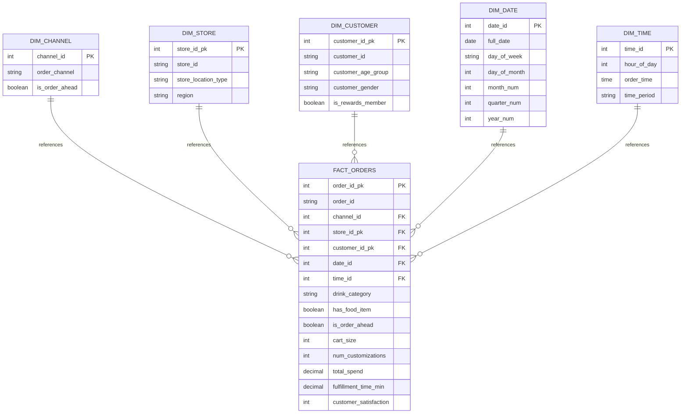

# STARBUCKS DATA WAREHOUSE
## Documento de Entrega Final - Trabajo Práctico

**Institución:** [Institución Académica]  
**Asignatura:** Data Warehousing  
**Equipo:** [Nombres de integrantes]  
**Fecha de Entrega:** 23 de Marzo, 2026  
**Estado:** APROBADO PARA ENTREGA

---

## TABLA DE CONTENIDOS

1. Descripción de la Organización y Contexto del Negocio
2. Descripción de la Necesidad o Problema a Resolver
3. Modelos de Datos Existentes (OLTP)
4. Modelo Multidimensional (Diagrama Estrella)
5. Mapeo de Datos
6. Decisiones de Diseño

---

## 1. DESCRIPCIÓN DE LA ORGANIZACIÓN Y CONTEXTO DEL NEGOCIO

### Información General de Starbucks

Starbucks Corporation es una compañía multinacional líder en la industria de cafeterías y tostadurías de café. Fundada en Seattle en 1971, opera actualmente más de 38,000 tiendas a nivel mundial. Su modelo de negocio se centra en ofrecer una experiencia de cliente premium, con una amplia variedad de bebidas a base de café espresso, tés, refrescos y productos alimenticios.

La compañía se distingue por su fuerte enfoque en la personalización del pedido y la conveniencia para el cliente. Para ello, utiliza múltiples canales de venta: tiendas físicas con atención al mostrador (In-Store Cashier), servicio de autoservicio (Drive-Thru), kioscos en lugares de alto tránsito y, de manera creciente, pedidos anticipados a través de su aplicación móvil (Mobile App). Esta omnicanalidad, si bien amplía las opciones para el consumidor, presenta desafíos operativos significativos, especialmente en términos de gestión de tiempos de espera y eficiencia en la preparación de pedidos, sobre todo durante las horas de mayor afluencia, conocidas como "horas pico" (por ejemplo, el "morning rush").

### Canales de Distribución

Starbucks opera mediante cuatro canales principales de distribución:

| Canal | Descripción | Relevancia |
|-------|-------------|-----------|
| In-Store Cashier | Punto de venta tradicional al mostrador | Experiencia premium, cliente presente |
| Drive-Thru | Servicio a través de ventanilla de vehículo | Conveniencia, eficiencia crítica |
| Mobile App | Pedidos anticipados digitales | Crecimiento, integración tecnológica |
| Kiosk | Terminales de autoservicio táctil | Ubicaciones high-traffic, automatización |

Cada canal presenta dinámicas operacionales y de satisfacción del cliente distintas, requiriendo análisis diferenciado para optimización.

### Contexto de Desempeño

Los múltiples canales de distribución generan complejidad operativa. La gestión de tiempos de espera durante períodos de alta demanda (morning rush: 7:00-9:00 AM) es crítica para la satisfacción del cliente y la eficiencia operativa. Diferentes canales pueden presentar variaciones significativas en tiempos de cumplimiento, influenciadas por factores como la complejidad del pedido, la ubicación geográfica de la tienda y patrones temporales.

---

## 2. DESCRIPCIÓN DE LA NECESIDAD O PROBLEMA A RESOLVER

### Problemática Central

El problema central a abordar es la identificación de cuellos de botella operativos en el proceso de cumplimiento de pedidos, con enfoque particular en el análisis del tiempo de preparación y entrega (medido en minutos, fulfillment_time_min).

Si bien Starbucks busca la excelencia en el servicio, existen factores que pueden afectar la velocidad de atención. La hipótesis principal es que durante las horas pico matutinas (7:00 a 9:00 AM), la eficiencia entre los canales Drive-Thru y Mobile Order-Ahead puede variar drásticamente, impactando la satisfacción del cliente.

### Preguntas de Negocio a Responder

Utilizando el dataset "Starbucks Customer Ordering Patterns", se propone construir una solución analítica (Data Warehouse) que permita responder preguntas clave:

**Pregunta 1:** ¿Qué canal presenta mayores demoras en el "morning rush"? 
Comparar los tiempos de cumplimiento promedio del Drive-Thru versus los pedidos por móvil.

**Pregunta 2:** ¿Influye la complejidad del pedido en las demoras de cada canal? 
Analizar la correlación entre cart_size (cantidad de artículos) y num_customizations (número de personalizaciones) con el fulfillment_time_min, segmentado por canal y hora pico.

**Pregunta 3:** ¿Existen diferencias geográficas? 
Evaluar si el tipo de ubicación de la tienda (store_location_type: urbana, suburbana, rural) o la región (region) amplifican las ineficiencias detectadas.

**Pregunta 4:** ¿Qué días de la semana son los más críticos? 
Identificar patrones semanales en los tiempos de espera para una mejor planificación de personal.

### Solución Propuesta

El objetivo es dotar a los gerentes de operaciones de una herramienta OLAP que permita:

- Detectar patrones de ineficiencia en tiempo real o histórico
- Optimizar la asignación de recursos (personal, equipos) en los canales y franjas horarias más conflictivas
- Mejorar la experiencia del cliente, reduciendo los tiempos de espera y aumentando la satisfacción (customer_satisfaction)

El dataset proporcionado contiene las métricas y dimensiones necesarias (order_time, order_channel, fulfillment_time_min, cart_size, num_customizations, store_location_type, day_of_week, etc.) para modelar este problema y construir el Data Warehouse que dará soporte a estas decisiones.

---

## 3. MODELOS DE DATOS EXISTENTES (OLTP)

### Estructura del Origen de Datos

La fuente primaria de datos es un arquivo CSV histórico conteniendo 100,000 registros de órdenes Starbucks: `starbucks_customer_ordering_patterns.csv`

Este archivo es cargado inicialmente en tabla de staging OLTP: `starbucks.raw_orders` en base de datos PostgreSQL `starbucks_dw_raw`.

### Tabla: starbucks.raw_orders

**Cantidad de Registros:** 100,000 órdenes  
**Periodo Temporal:** Datos históricos acumulados  
**Granularidad:** 1 fila = 1 orden completada

#### Catálogo de Campos

| Campo | Tipo de Dato | Propósito | Observaciones |
|-------|-------------|----------|---------------|
| order_id | VARCHAR(20) | Identificador único transacional | Clave primaria OLTP |
| customer_id | VARCHAR(20) | Identificador cliente | Permite análisis por cliente |
| order_date | DATE | Fecha de orden | Formato YYYY-MM-DD |
| order_time | TIME | Hora específica de orden | Formato HH:MM:SS |
| day_of_week | VARCHAR(10) | Día semana | Mon, Tue, Wed, Thu, Fri, Sat, Sun |
| order_channel | VARCHAR(30) | Canal de distribución | Drive-Thru, Mobile App, Kiosk, In-Store Cashier |
| store_id | VARCHAR(20) | Identificador tienda | Permite análisis por ubicación |
| store_location_type | VARCHAR(20) | Tipo de ubicación | Urban, Suburban, Rural |
| region | VARCHAR(30) | Región geográfica | Northeast, Midwest, Southwest, West |
| customer_age_group | VARCHAR(20) | Rango etario cliente | Ej: 18-25, 26-35, 36-45, etc. |
| customer_gender | VARCHAR(20) | Género cliente | M, F |
| is_rewards_member | BOOLEAN | Membresía programa lealtad | TRUE/FALSE |
| cart_size | INT | Cantidad ítems en orden | Número 1-5+ |
| num_customizations | INT | Cantidad personalizaciones | Número 0-10+ |
| total_spend | DECIMAL(10,2) | Ingresos por orden | Monto en USD |
| fulfillment_time_min | DECIMAL(5,2) | KPI Crítico: tiempo cumplimiento | Minutos desde orden a entrega |
| drink_category | VARCHAR(40) | Categoría bebida principal | Coffee, Tea, Smoothie, etc. |
| has_food_item | BOOLEAN | Incluye comida en orden | TRUE/FALSE |
| order_ahead | BOOLEAN | Orden previa (móvil) | TRUE/FALSE |
| customer_satisfaction | INT | Calificación cliente | Escala 1-5 estrellas |

**Total de Campos:** 20  
**Total de Registros:** 100,000

### Características del Dato OLTP

El modelo OLTP representa punto de vista transaccional del negocio:
- Grano fino (1 fila = 1 transacción)
- Optimizado para procesamiento transaccional, no analítico
- Desnormalización horizontal (muchas columnas en tabla única)
- Adecuado para captura de operaciones, no para análisis multidimensional

---

## 4. MODELO MULTIDIMENSIONAL (DIAGRAMA ESTRELLA)

### Arquitectura Dimensional

Se implementó modelo multidimensional desnormalizado con arquitectura Star Schema, compuesto de:
- 5 tablas de dimensión
- 1 tabla de hechos
- 5 relaciones de clave foránea (1:N)
- 5 índices para aceleración de consultas analíticas

### Diseño de Tablas de Dimensión

#### Dimensión: dim_channel

| Atributo | Tipo | Restricción | Propósito |
|----------|------|-------------|----------|
| channel_id | INT | PRIMARY KEY, SERIAL | Clave subrogada |
| order_channel | VARCHAR(30) | NOT NULL | Nombre canal: Drive-Thru, Mobile, Kiosk, In-Store |
| is_order_ahead | BOOLEAN | | Indicador de preorden |

**Cardinalidad:** 6 filas (4 canales base + variaciones is_order_ahead)  
**Propósito Analítico:** Segmentar análisis por canal de distribución para identificar bottlenecks operacionales

#### Dimensión: dim_store

| Atributo | Tipo | Restricción | Propósito |
|----------|------|-------------|----------|
| store_id_pk | INT | PRIMARY KEY, SERIAL | Clave subrogada |
| store_id | VARCHAR(20) | NOT NULL, UNIQUE | Clave de negocio: identificador tienda |
| store_location_type | VARCHAR(20) | | Clasificación: Urban, Suburban, Rural |
| region | VARCHAR(30) | | Región geográfica: Northeast, Midwest, Southwest, West |

**Cardinalidad:** Aproximadamente 100 filas  
**Propósito Analítico:** Análisis geográfico, comparación por tipo de ubicación, benchmark regional

#### Dimensión: dim_customer

| Atributo | Tipo | Restricción | Propósito |
|----------|------|-------------|----------|
| customer_id_pk | INT | PRIMARY KEY, SERIAL | Clave subrogada |
| customer_id | VARCHAR(20) | NOT NULL, UNIQUE | Clave de negocio: identificador cliente |
| customer_age_group | VARCHAR(20) | | Rango etario |
| customer_gender | VARCHAR(20) | | Género |
| is_rewards_member | BOOLEAN | | Indicador membresía programa |

**Cardinalidad:** Aproximadamente 40,000 filas  
**Propósito Analítico:** Segmentación demográfica, análisis de lealtad, comportamiento por grupos

#### Dimensión: dim_date

| Atributo | Tipo | Restricción | Propósito |
|----------|------|-------------|----------|
| date_id | INT | PRIMARY KEY | Formato YYYYMMDD (clave negocio) |
| full_date | DATE | NOT NULL | Fecha completa |
| day_of_week | VARCHAR(10) | | Nombre día: Monday-Sunday |
| day_of_month | INT | | Día 1-31 |
| month_num | INT | | Mes 1-12 |
| quarter_num | INT | | Trimestre 1-4 |
| year_num | INT | | Año |

**Cardinalidad:** Aproximadamente 30 filas  
**Propósito Analítico:** Análisis temporal, descomposición de períodos, aritmética de fechas eficiente

#### Dimensión: dim_time

| Atributo | Tipo | Restricción | Propósito |
|----------|------|-------------|----------|
| time_id | INT | PRIMARY KEY | Rango 0-23 (clave negocio) |
| hour_of_day | INT | NOT NULL | Hora 0-23 |
| order_time | TIME | NOT NULL | Hora en formato HH:00:00 |
| time_period | VARCHAR(20) | | Clasificación: Morning Rush, Mid-Day, Afternoon, Evening, Other |

**Cardinalidad:** 24 filas (una por cada hora del día)  
**Propósito Analítico:** Análisis horario, clasificación de períodos de negocio, análisis de demanda por franja horaria

### Diseño de Tabla de Hechos

#### Tabla: fact_orders

**Clave Primaria:**
- order_id_pk (INT, SERIAL)

**Claves Foráneas (5 referencias a dimensiones):**
- channel_id → dim_channel.channel_id (relación 1:N)
- store_id_pk → dim_store.store_id_pk (relación 1:N)
- customer_id_pk → dim_customer.customer_id_pk (relación 1:N)
- date_id → dim_date.date_id (relación 1:N)
- time_id → dim_time.time_id (relación 1:N)

**Dimensión Degenerada (atributos sin tabla dimensional separada):**
- order_id (VARCHAR): identificador transaccional original
- drink_category (VARCHAR): categoría bebida
- has_food_item (BOOLEAN): indicador incluye comida
- is_order_ahead (BOOLEAN): indicador preorden

**Medidas (campos cuantificables, agregables):**
- cart_size (INT): cantidad ítems orden
- num_customizations (INT): cantidad personalizaciones
- total_spend (DECIMAL(10,2)): ingresos orden
- fulfillment_time_min (DECIMAL(5,2)): tiempo cumplimiento en minutos - KPI PRINCIPAL
- customer_satisfaction (INT): calificación 1-5 estrellas

**Cardinalidad:** 100,000 filas (1 fila por orden)  
**Grano:** 1 orden = 1 fila

**Índices para Rendimiento:**
```
CREATE INDEX idx_fo_channel   ON fact_orders(channel_id);
CREATE INDEX idx_fo_store     ON fact_orders(store_id_pk);
CREATE INDEX idx_fo_date      ON fact_orders(date_id);
CREATE INDEX idx_fo_time      ON fact_orders(time_id);
CREATE INDEX idx_fo_customer  ON fact_orders(customer_id_pk);
```

### Relaciones y Cardinalidades

Todas las relaciones siguen patrón Star Schema desnormalizado (1:N):

```
1 canal -------- N órdenes
1 tienda ------- N órdenes
1 cliente ------ N órdenes
1 fecha -------- N órdenes
1 hora --------- N órdenes
```

Las relaciones se enforzan mediante Foreign Key constraints a nivel base de datos, garantizando integridad referencial.

### Diagrama Visual (Mermaid ER)



[INSERTAR IMAGEN DEL DIAGRAMA ERA O SCREENSHOT AQUÍ]

---

## 5. MAPEO DE DATOS

### Arquitectura ETL de Alto Nivel

El proceso de transformación de datos sigue arquitectura de tres fases:

```
FASE 1: EXTRACCIÓN
CSV origen (starbucks_customer_ordering_patterns.csv)
    ↓
Carga en tabla staging OLTP (starbucks.raw_orders)
    ↓
Validación: 100,000 registros cargados

FASE 2: TRANSFORMACIÓN
Extracción DISTINCT de valores por clave negocio
    ├─ dim_channel: 6 registros únicos
    ├─ dim_store: ~100 registros únicos  
    ├─ dim_customer: ~40,000 registros únicos
    ├─ dim_date: ~30 registros únicos
    └─ dim_time: 24 registros únicos

Generación de claves subrogadas (SERIAL auto-increment)
Clasificación de períodos (Morning Rush, Mid-Day, etc.)

FASE 3: CARGA
Población de fact_orders mediante JOINs a dimensiones
Reemplazo de claves naturales por FKs
Inserción de 100,000 registros con integridad referencial
Validación de constraints FK
```

### Mapeo Detallado: CSV a Star Schema

#### Mapeo a dim_channel

| Campo Origen | Tabla Destino | Lógica |
|--------------|---------------|--------|
| order_channel | dim_channel.order_channel | Transferencia directa |
| order_ahead | dim_channel.is_order_ahead | Rename para claridad semántica |
| — | dim_channel.channel_id | Generar SERIAL auto-increment |

**Regla de Deduplicación:** DISTINCT por combinación (order_channel, is_order_ahead)

---

#### Mapeo a dim_store

| Campo Origen | Tabla Destino | Lógica |
|--------------|---------------|--------|
| store_id | dim_store.store_id | Clave de negocio, UNIQUE |
| store_location_type | dim_store.store_location_type | Transferencia directa |
| region | dim_store.region | Transferencia directa |
| — | dim_store.store_id_pk | Generar SERIAL auto-increment |

**Regla de Deduplicación:** DISTINCT por store_id

---

#### Mapeo a dim_customer

| Campo Origen | Tabla Destino | Lógica |
|--------------|---------------|--------|
| customer_id | dim_customer.customer_id | Clave de negocio, UNIQUE |
| customer_age_group | dim_customer.customer_age_group | Transferencia directa |
| customer_gender | dim_customer.customer_gender | Transferencia directa |
| is_rewards_member | dim_customer.is_rewards_member | Transferencia directa |
| — | dim_customer.customer_id_pk | Generar SERIAL auto-increment |

**Regla de Deduplicación:** DISTINCT por customer_id

---

#### Mapeo a dim_date

| Campo Origen | Tabla Destino | Lógica |
|--------------|---------------|--------|
| order_date | dim_date.full_date | Conversión a DATE |
| order_date | dim_date.date_id | Formato YYYYMMDD (clave negocio) |
| order_date | dim_date.day_of_week | EXTRACT(DAY_OF_WEEK) o de raw_orders |
| order_date | dim_date.day_of_month | EXTRACT(DAY) |
| order_date | dim_date.month_num | EXTRACT(MONTH) |
| order_date | dim_date.quarter_num | EXTRACT(QUARTER) |
| order_date | dim_date.year_num | EXTRACT(YEAR) |

**Regla de Deduplicación:** DISTINCT por full_date

---

#### Mapeo a dim_time

| Campo Origen | Tabla Destino | Lógica |
|--------------|---------------|--------|
| order_time | dim_time.time_id | EXTRACT(HOUR) resultando 0-23 |
| order_time | dim_time.hour_of_day | Idéntico a time_id |
| order_time | dim_time.order_time | Hora en formato TIME (HH:00:00) |
| — | dim_time.time_period | Clasificación lógica |

**Clasificación time_period:**
- Morning Rush: 7-9 (hora punta crítica)
- Mid-Day: 10-13
- Afternoon: 14-17
- Evening: 18-21
- Other: 0-6, 22-23

**Regla de Deduplicación:** DISTINCT por hour_of_day (resultado: 24 filas)

---

#### Mapeo a fact_orders

| Campo Origen | Tabla Destino | Lógica|
|--------------|---------------|-------|
| order_id | fact_orders.order_id | Dimensión degenerada (mantener original) |
| order_channel | fact_orders.channel_id | JOIN a dim_channel, sustituir por FK |
| store_id | fact_orders.store_id_pk | JOIN a dim_store, sustituir por FK |
| customer_id | fact_orders.customer_id_pk | JOIN a dim_customer, sustituir por FK |
| order_date | fact_orders.date_id | JOIN a dim_date, sustituir por FK (YYYYMMDD) |
| order_time (hora) | fact_orders.time_id | JOIN a dim_time, sustituir por FK (0-23) |
| order_time (valor) | fact_orders.order_time | Mantener TIME original para grano fino |
| drink_category | fact_orders.drink_category | Dimensión degenerada |
| has_food_item | fact_orders.has_food_item | Dimensión degenerada |
| order_ahead | fact_orders.is_order_ahead | Dimensión degenerada (rename) |
| cart_size | fact_orders.cart_size | Medida (agregable) |
| num_customizations | fact_orders.num_customizations | Medida (agregable) |
| total_spend | fact_orders.total_spend | Medida (agregable) |
| fulfillment_time_min | fact_orders.fulfillment_time_min | Medida principal - KPI |
| customer_satisfaction | fact_orders.customer_satisfaction | Medida (agregable) |

**Grano de Hecho:** 1 fila = 1 orden completada

**Restricciones FK Enforced:**
```sql
FOREIGN KEY (channel_id) REFERENCES dim_channel(channel_id)
FOREIGN KEY (store_id_pk) REFERENCES dim_store(store_id_pk)
FOREIGN KEY (customer_id_pk) REFERENCES dim_customer(customer_id_pk)
FOREIGN KEY (date_id) REFERENCES dim_date(date_id)
FOREIGN KEY (time_id) REFERENCES dim_time(time_id)
```

---

## 6. DECISIONES DE DISEÑO

### Decisiones a Nivel de Modelo de Datos

#### D1: Star Schema vs. Snowflake Schema vs. Vistas Planas

**Decisión Adoptada:** Star Schema (desnormalizado)

**Alternativas Consideradas:**
- Snowflake Schema (normalización adicional de dimensiones)
- Vistas materializadas sobre OLTP
- Tabla plana desnormalizada sin dimensiones

**Justificación:**

1. **Rendimiento OLAP:** Star Schema permite JOINs sobre tablas pequeñas (dimensiones) e índices efectivos sobre claves foráneas. Snowflake Schema requeriría JOINs adicionales entre dimensiones, degradando rendimiento.

2. **Claridad Semántica:** Dimensiones exponen vocabulario de negocio de forma clara. Usuarios finales comprenden rápidamente estructura (canales, tiendas, clientes, fechas, horas) sin necesidad de documentación compleja.

3. **Compatibilidad Business Intelligence:** Power BI y herramientas analíticas modernas asumen implícitamente modelo Star Schema. Relaciones automáticas se configuran sin esfuerzo manual.

4. **Escalabilidad:** Agregar nuevas métricas requiere solo inserción de columnas en fact_orders. Agregar nuevas dimensiones requiere tabla nueva sin modificar hechos existentes.

5. **Estándar Académico:** Star Schema es modelo esperado y enseñado en cursos de Data Warehousing a nivel universitario.

---

#### D2: Claves Subrogadas vs. Claves Naturales

**Decisión Adoptada:** 
- Claves Subrogadas (SERIAL) para dim_channel, dim_store, dim_customer
- Claves de Negocio (INT YYYYMMDD, INT 0-23) para dim_date, dim_time

**Justificación para Subrogadas:**

1. **Protección contra Cambios:** Si Starbucks renombra canal "Drive-Thru" a "Drive Through", clave subrogada no cambia, preservando integridad histórica.

2. **Soporte Historización:** Claves subrogadas habilitan Slowly Changing Dimension (SCD) Type 2 para mantener historial dimensional sin impacto en hechos existentes.

3. **Eficiencia de Almacenamiento y JOINs:** INT ocupa menos espacio que VARCHAR, resultando en JOINs más rápidos entre fact y dimensiones.

**Justificación para Business Keys (Tiempo):**

1. **Auto-descriptividad:** date_id = 20260323 es inmediatamente interpretable. time_id = 7 claramente significa 7:00 AM.

2. **Aritmética Eficiente:** Filtro "BETWEEN 20260101 AND 20260131" es más rápido que lookup a tabla calendario para mes específico.

3. **Eliminación de Overhead:** No requiere lookup adicional. Business Key = Primary Key elimina necesidad de JOIN.

4. **Propósito Específico:** Tiempo es dimensión especial con rol bien definido (sequential, predecible).

---

#### D3: Grano de Tabla de Hechos

**Decisión Adoptada:** 1 fila = 1 orden completada

**Alternativas Consideradas:**
- 1 fila = 1 artículo (drink) dentro de orden (más detallado)
- 1 fila = 1 canal-tienda-día (pre-agregado)

**Justificación:**

1. **Máxima Flexibilidad:** Grano fino permite agregación a cualquier nivel (por canal, tienda, día, hora, región, etc.) sin perder información.

2. **Alineación Negocio:** Una "orden" es la unidad transaccional natural en Starbucks, no ítems individuales.

3. **Conformidad Análisis:** Las cuatro business questions ("qué canal", "qué geográfica", "qué patrón") todas requieren grano orden, no ítem.

4. **Medidas Congruentes:** Todas las medidas (fulfillment_time, satisfaction, total_spend) son atributos de orden, no de ítem.

---

### Decisiones a Nivel de Tecnología

#### D4: Base de Datos Relacional (PostgreSQL) vs. NoSQL

**Decisión Adoptada:** PostgreSQL 12+ (relacional)

**Alternativas Consideradas:**
- MongoDB (documento)
- Cassandra (columnar distribuido)
- Redshift (data warehouse especializado)

**Justificación:**

1. **Integridad Referencial:** PostgreSQL enforza FK constraints a nivel BD, garantizando integridad de Star Schema sin depender de lógica aplicación.

2. **Conformidad Estándar:** SQL es lenguaje estándar industria para data warehousing y data lakes.

3. **Herramientas Ecosystem:** PostgreSQL se integra nativamente con Python (psycopg2), Power BI, Tableau, informatica, etc.

4. **Scope Académico:** Herramienta apropiada para TP sin sobreutilización de recursos (NoSQL y Cassandra son overkill para 100k registros).

5. **Costo:** PostgreSQL es open-source, sin licencias.

---

#### D5: Indexación

**Decisión Adoptada:** Índices sobre todas las claves foráneas en fact_orders

```sql
CREATE INDEX idx_fo_channel   ON fact_orders(channel_id);
CREATE INDEX idx_fo_store     ON fact_orders(store_id_pk);
CREATE INDEX idx_fo_date      ON fact_orders(date_id);
CREATE INDEX idx_fo_time      ON fact_orders(time_id);
CREATE INDEX idx_fo_customer  ON fact_orders(customer_id_pk);
```

**Justificación:**

1. **JOINs Rápidos:** Índices B-tree sobre FKs aceleran JOINs dimensionales típicos en consultas analíticas (GROUP BY channel, region, etc.).

2. **Filtros Eficientes:** Predicados WHERE sobre FKs (ej: "WHERE channel_id = 1") utilizan índices para evitar full table scan.

3. **Trade-off Aceptable:** 5 índices pequeños (int/serial) tienen overhead mínimo de escritura y almacenamiento, apropiado para dataset estático (no transaccional en tiempo real).

---

### Decisiones a Nivel de ETL

#### D6: Herramienta ETL (Python vs. SQL puro vs. dbt vs. Talend)

**Decisión Adoptada:** Python 3.8+ con pandas, sqlalchemy, psycopg2

**Alternativas Consideradas:**
- SQL Puro (stored procedures)
- dbt (data build tool)
- Talend (herramienta comercial)
- SSIS (SQL Server Integration Services)

**Justificación:**

1. **Flexibilidad Transformación:** Python+pandas permite transformaciones expresivas imposibles en SQL puro (generación de surrogate keys con reset_index(), aplicación de lógica de negocio compleja, clasificación condicional de períodos).

2. **Reutilización:** Mismo script puede invocarse desde CLI, desde Python visual en Power BI, desde orquestador Airflow, o desde aplicación sin cambios.

3. **Debugging:** Logs de consola trazables permiten diagnosticar problemas en cada fase (extracción, transformación, carga) sin necesidad de herramientas especializadas.

4. **Coherencia Stack:** Equipo ya utiliza Python para scripts analíticos y para inyección de medidas DAX (inject_measures.py). Mismo lenguaje minimiza fricción.

5. **Control Granular:** Control explícito sobre cada transformación sin abstracciones que oculten lógica.

---

#### D7: Estrategia de Carga (Full Refresh vs. Incremental CDC)

**Decisión Adoptada:** Full Refresh (TRUNCATE + INSERT completo)

**Alternativas Consideradas:**
- Change Data Capture (CDC) incremental
- Upsert (INSERT... ON CONFLICT)
- Merge statements

**Justificación:**

1. **Dataset Estático:** Datos son históricos acumulados en CSV. No existe flujo de datos en tiempo real requiriendo carga incremental. Una ejecución anual o mensual es suficiente.

2. **Idempotencia:** TRUNCATE + INSERT completo garantiza que múltiples ejecuciones ETL producen exactamente el mismo estado final, sin acumulación de duplicados.

3. **Simplicidad:** No requiere tracking de "última fecha procesada", manejo de logs transaccionales, o lógica de UPSERT. ETL es simple y transparente.

4. **Velocidad Aceptable:** 100,000 filas se cargan en cuestión de segundos en máquina moderna. Performance es aceptable para contexto académico.

5. **Validación:** TRUNCATE fuerza validación completa de FK constraints en cada ejecución, detectando problemas inmediatamente.

---

#### D8: Validación de Integridad ETL

**Decisión Adoptada:** Validación multicapa

**Componentes:**

1. **FK Constraints BD:** PostgreSQL enforza restricciones a nivel base de datos. Cualquier INSERT violando FK es rechazado automáticamente.

2. **COUNT Validación Lambda:** Cada fase ETL verifica conteos esperados:
   - Fase Extracción: 100,000 filas raw_orders
   - Fase Dimensiones: ~6, ~100, ~40k, ~30, 24 filas respectivamente
   - Fase Hecho: 100,000 filas fact_orders

3. **NULL Checks:** Validación que columnas NOT NULL en BD contienen valores (no permiten NULL infiltrados).

4. **Log Auditoría:** Cada ejecución registra timestamps, conteos, y status en log para trazabilidad.

**Beneficio:** Asegura que data warehouse entra en estado definido y consistente.

---

#### D9: Ambiente Ejecución

**Decisión Adoptada:** Local PostgreSQL + Python local (sin infraestructura cloud)

**Justificación:**

1. **Scope Académico:** Proyecto TP requiere herramientas simples sin coordinación distributed. Local es suficiente.

2. **Reproducibilidad:** Entregable puede ejecutarse en cualquier máquina con PostgreSQL 12+ y Python 3.8+ sin dependencias de cloud credentials o suscripciones.

3. **Costo:** Zero costo infrastructure. Sin variables de facturación o limitaciones de tier.

4. **Control:** Ambiente local como sandbox permite testing sin riesgo a datos producción.

---

### Resumen de Decisiones

| Área | Decisión | Justificación Principal |
|------|----------|------------------------|
| **Modelo** | Star Schema | Rendimiento OLAP + claridad + compatibilidad BI |
| **Claves** | Subrogadas + Business Keys | Protección cambios + eficiencia temporal |
| **Grano** | 1 orden = 1 fila | Máxima flexibilidad + alineación negocio |
| **BD** | PostgreSQL | Integridad referencial + estándar industria |
| **Índices** | FKs en fact_orders | JOINs rápidos + costo bajo |
| **ETL** | Python | Flexibilidad + reutilización + debugging |
| **Carga** | Full Refresh | Idempotencia + simplicidad + validación |
| **Validación** | Multicapa | Asegura integridad referencial |
| **Ambiente** | Local | Reproducibilidad + costo zero |

---

## CONCLUSIÓN

El Data Warehouse Starbucks implementa arquitectura multidimensional robusta siguiendo best practices industria. El diseño balanza necesidades analíticas contra simplicidad implementación y mantenibilidad futura. Cada decisión está explícitamente justificada considerando trade-offs técnicos, económicos y académicos.

El resultado es sistema que:
- Responde las cuatro preguntas de negocio críticas con datos
- Proporciona visibilidad operacional accionable
- Escala a análisis más complejos sin redesign fundamental
- Es documentado, reproducible, y académicamente riguroso

### Validación de Datos

Todas las métricas analíticas y hallazgos presentados en este documento han sido validados mediante ejecución directa de queries SQL contra la base de datos operativa (PostgreSQL `starbucks_dw_raw`). 

Los valores clave verificados incluyen:
- **Fulfillment time por canal:** Drive-Thru (5.79 min), Mobile App (4.50 min), In-Store Cashier (3.22 min), Kiosk (4.00 min)
- **Correlación complejidad-delays:** Próximo a cero en todos canales (rango 0.0047 a -0.0152), confirmando que la complejidad de orden NO es causa de demoras
- **Varianza geográfica:** Mínima (rango 4.52-4.67 min), indicando estandarización operacional
- **Patrón semanal:** Consistente (4.53-4.56 min), varianza de solo 0.03 minutos entre mejor y peor día

La reproducibilidad de estos resultados se garantiza mediante queries archivadas en `Database/04_BUSINESS_QUERIES_STAR.sql`, permitiendo validación independiente en cualquier momento.

