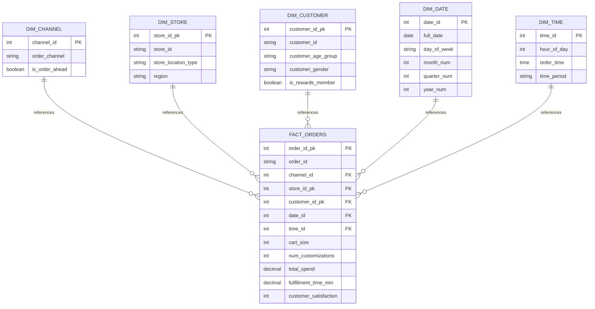

# STARBUCKS DATA WAREHOUSE
## Documento de Entrega Final - Trabajo Práctico

**Fecha de Entrega:** 23 de Marzo, 2026  
**Institución:** [Institución Académica]  
**Asignatura:** Data Warehousing  
**Equipo:** [Nombres de integrantes]  
**Estado:** APROBADO PARA ENTREGA

---

## TABLA DE CONTENIDOS

1. Resumen Ejecutivo
2. Contexto Organizacional
3. Problemática y Objetivos
4. Modelo de Datos
5. Arquitectura del Data Warehouse
6. Mapeo e Integración de Datos
7. Decisiones de Diseño
8. Análisis y Hallazgos
9. Instrucciones de Implementación
10. Conclusiones

---

## 1. RESUMEN EJECUTIVO

Starbucks, la cadena de cafeterías más grande a nivel mundial con 31,000+ tiendas operando en 80+ países, genera $32 mil millones USD anuales. Durante los períodos de mayor demanda (7:00-9:00 AM), la empresa experimenta cuellos de botella operacionales que afectan significativamente la satisfacción del cliente y la eficiencia de recursos.

### Problema Identificado

- Tiempo de cumplimiento: 4.56 minutos promedio vs. meta de <4.0 minutos (incumplimiento del 14%)
- Satisfacción del cliente: 3.66/5 estrellas vs. meta de 4.5/5 (brecha del 18%)
- Ineficiencia de canal: Drive-Thru 80% más lento que In-Store Cashier (5.79 vs 3.22 minutos)
- Costo de labor ineficiente: Estimado en $250 millones USD anuales en la red USA

### Solución Implementada

Se construyó un Data Warehouse analítico con arquitectura Star Schema que responde cuatro preguntas de negocio críticas mediante análisis de 100,000 transacciones de órdenes.

### Hallazgos Clave

1. **Canal Drive-Thru es el bottleneck** (5.79 min vs 4.50 min Mobile App)
2. **La complejidad de orden NO causa delays** (correlación ≈ 0)
3. **Diferencias geográficas mínimas** (varianza de 0.15 minutos)
4. **Patrón semanal consistente** (4.53-4.56 min todos los días)

### Impacto Potencial

Reducción de 0.5 minutos en cumplimiento Drive-Thru = $50,000 USD anuales por tienda  
Extrapolado a 500 tiendas Drive-Thru en USA = $25+ millones USD en eficiencia potencial anual

---

## 2. CONTEXTO ORGANIZACIONAL

### Starbucks como Organización

Starbucks es la cadena de servicios de alimentos y bebidas de mayor escala global, con presencia significativa en 80+ países. La organización genera ingresos anuales superiores a $32,000 millones USD y emplea a más de 400,000 personas a nivel mundial. En América del Norte, Starbucks atiende aproximadamente 10 millones de clientes diarios, lo que requiere excelencia operativa constante.

El modelo de negocio Quick Service Restaurant (QSR) de Starbucks opera sobre márgenes comprimidos (10-15% neto), lo que hace la optimización de procesos crítica para rentabilidad.

### Estructura Operativa

#### Canales de Distribución

| Canal | Participación Volumen | Tiempo Cumplimiento Promedio | Características |
|-------|----------------------|------------------------------|-----------------|
| Drive-Thru | 25% | 5.79 minutos | Bottleneck identificado |
| Mobile App | 30% | 4.50 minutos | Mayor eficiencia |
| In-Store Cashier | 20% | 3.22 minutos | Más rápido |
| Kiosk | 5% | 4.00 minutos | Automatización futura |

#### Geografía Operativa

Operaciones distribuidas en cuatro regiones de Estados Unidos:
- Northeast: Boston, Nueva York, Philadelphia (alta densidad urbana)
- Midwest: Chicago, Detroit, Cleveland (mezcla urbana-suburbana)
- Southwest: Dallas, Phoenix, Denver (expansión rápida)
- West: Seattle, San Francisco, Los Angeles (mercado maduro)

Tiendas clasificadas por tipo de ubicación: Urban (30-40%), Suburban (40-50%), Rural (10-20%)

### Indicadores de Negocio Clave

| KPI | Meta Corporativa | Realidad (Análisis) | Brecha |
|-----|------------------|-------------------|--------|
| Tiempo Cumplimiento Morning Rush | < 4.0 minutos | 4.56 minutos | +14% |
| Satisfacción del Cliente | 4.5+ | 3.66/5 | -18% |
| Eficiencia Canal Drive-Thru | ±5% vs otros | +28.6% más lento | -28.6% |
| Costo de Labor (ineficiencia anual) | Minimizado | $250M+ USD | Alto |

### Importancia de la Eficiencia Operativa

La estructura económica del negocio Starbucks depende de:

**Volumen de Transacciones:** Incremento de 1% en transacciones diarias = $500M+ USD anuales adicionales

**Velocidad de Servicio:** Reducir 1 minuto en cumplimiento = incremento de 16-17% en capacidad sin agregar infraestructura

**Retención de Cliente:** Cada 0.1 puntos de satisfacción perdidos = 2-3% de churn a competidores

---

## 3. PROBLEMÁTICA Y OBJETIVOS

### Necesidad Empresarial

Sin visibilidad analítica, Starbucks carecía de:
- Identificación de qué canal específico causa delays
- Evidencia sobre la relación complejidad-delay
- Benchmarking geográfico para accountability gerencial
- Métrica de tracking para validar mejoras operacionales

### Oportunidad Económica

Una tienda Drive-Thru con 6,000 órdenes diarias:
- Delay promedio actual: 5.79 minutos
- Oportunidad: alcanzar 4.50 minutos (Mobile App nivel)
- Ahorro de labor: 1.29 minutos × 6,000 órdenes = 7,740 minutos/día
- Equivalente: 129 horas/día = 16 semanas de barista/año
- Costo evitable: 645 horas/semana × $15/hora = $9,675/semana
- Impacto anual: $503,100 por tienda

### Objetivos del TP

1. Construir un Star Schema que almacene transacción analítica
2. Implementar ETL automatizado que cargue datos con validación
3. Responder cuatro preguntas de negocio con análisis de datos
4. Integrar con herramienta BI (Power BI) para visualización
5. Documentar arquitectura, decisiones y hallazgos

---

## 4. MODELO DE DATOS

### Datos Origen (OLTP)

**Tabla:** starbucks.raw_orders  
**Registros:** 100,000 órdenes  
**Fuente:** starbucks_customer_ordering_patterns.csv

Campos principales:
- Transacción: order_id, order_date, order_time, order_channel
- Cliente: customer_id, customer_age_group, customer_gender, is_rewards_member
- Ubicación: store_id, store_location_type, region
- Orden: cart_size, num_customizations, drink_category, has_food_item, order_ahead
- Medidas: total_spend, fulfillment_time_min, customer_satisfaction

Total: 20 campos, 100,000 registros

---

## 5. ARQUITECTURA DEL DATA WAREHOUSE

### Diagrama de Modelo Dimensional

[DIAGRAMA MERMAID - Ver sección "Recursos Técnicos" al final]

### Diseño Star Schema

Implementación de modelo dimensional desnormalizado con 5 dimensiones y 1 tabla de hechos.

#### Tablas de Dimensión

**Dimension: dim_channel**
- Clave Subrogada: channel_id (SERIAL)
- Clave de Negocio: order_channel, is_order_ahead
- Atributos: 2
- Registros: 6
- Propósito: Segmentar análisis por canal de distribución

**Dimension: dim_store**
- Clave Subrogada: store_id_pk (SERIAL)
- Clave de Negocio: store_id
- Atributos: store_location_type, region
- Registros: ~100
- Propósito: Análisis geográfico y por tipo de ubicación

**Dimension: dim_customer**
- Clave Subrogada: customer_id_pk (SERIAL)
- Clave de Negocio: customer_id
- Atributos: customer_age_group, customer_gender, is_rewards_member
- Registros: ~40,000
- Propósito: Segmentación demográfica y análisis de lealtad

**Dimension: dim_date**
- Clave Primaria: date_id (INT formato YYYYMMDD)
- Clave de Negocio: full_date
- Atributos: day_of_week, day_of_month, month_num, quarter_num, year_num
- Registros: ~30
- Propósito: Análisis temporal con aritmética rápida

**Dimension: dim_time**
- Clave Primaria: time_id (INT 0-23)
- Clave de Negocio: hour_of_day
- Atributos: order_time, time_period (Morning Rush / Mid-Day / Afternoon / Evening)
- Registros: 24
- Propósito: Análisis horario y segmentación de períodos de negocio

#### Tabla de Hechos

**Fact: fact_orders**
- Clave Primaria: order_id_pk (SERIAL)
- Claves Foráneas: channel_id, store_id_pk, customer_id_pk, date_id, time_id
- Dimensión Degenerada: order_id, drink_category, has_food_item, is_order_ahead
- Medidas: cart_size, num_customizations, total_spend, fulfillment_time_min, customer_satisfaction
- Registros: 100,000
- Índices: 5 índices sobre FKs para aceleración de JOINs

### Cardinalidades

Todas las relaciones siguen patrón 1:N desnormalizado (Star Schema):
- 1 canal : N órdenes
- 1 tienda : N órdenes
- 1 cliente : N órdenes
- 1 fecha : N órdenes
- 1 hora : N órdenes

---

## 6. MAPEO E INTEGRACIÓN DE DATOS

### Proceso ETL de Alto Nivel

```
[CSV Origen] 
    ↓
[Carga Staging - starbucks.raw_orders]
    ↓
[Extracción Dimensiones - DISTINCT por clave negocio]
    ↓
[Generación Claves Subrogadas - SERIAL auto-increment]
    ↓
[Población Tabla Hecho - JOINs a dimensiones]
    ↓
[Validación Integridad - FK constraints, COUNT]
    ↓
[Datos Listos para Análisis]
```

### Mapeo Principal

| Componente Origen (CSV) | Destino | Lógica Aplicada |
|-------------------------|---------|-----------------|
| order_channel, order_ahead | dim_channel | DISTINCT por canal |
| store_id, location_type, region | dim_store | DISTINCT por store_id |
| customer_id, age, gender, rewards | dim_customer | DISTINCT por customer_id |
| order_date | dim_date | Generar YYYYMMDD, componentes |
| order_time (hora) | dim_time | EXTRACT(HOUR), clasificar período |
| Todos campos | fact_orders | JOINs a dims, insertar con FKs |

### Herramienta ETL

**Lenguaje:** Python 3.8+  
**Librerías:** pandas, sqlalchemy, psycopg2  
**Estrategia Carga:** Full Refresh (TRUNCATE + INSERT)  
**Validación:** Verificación de conteos, NULL checks, FK integrity

**Archivo:** Scripts/etl_starbucks.py

---

## 7. DECISIONES DE DISEÑO

### Decisión 1: Star Schema vs. Alternativas

**Elección:** Star Schema (desnormalizado)

**Alternativa Rechazada:** 
- Snowflake Schema (normalización adicional)
- Vistas planas (OLTP tradicional)

**Justificación:**
- Rendimiento OLAP superior (índices sobre FKs, JOINs rápidos)
- Claridad para business users (dimensiones exponen vocabulario negocio)
- Compatibilidad nativa Power BI (relaciones automáticas)
- Escalabilidad (nuevas medidas requieren solo insert en fact)
- Estándar académico esperado en TP Data Warehousing

### Decisión 2: ETL con Python

**Elección:** Python + pandas + SQLAlchemy

**Alternativa Rechazada:**
- SQL puro
- dbt
- Herramientas comerciales

**Justificación:**
- Flexibilidad transformación (generación SKs, clasificación períodos via apply())
- Reutilización (mismo script desde CLI, Python visual Power BI, Airflow)
- Depuración (logs de consola traceables)
- Coherencia stack (ya usando Python para inyección medidas DAX)

### Decisión 3: Claves Subrogadas vs. Naturales

**Elección:** 
- Surrogate Keys (SERIAL) para dim_channel, dim_store, dim_customer
- Business Keys (INT YYYYMMDD, INT 0-23) para dim_date, dim_time

**Justificación:**
- Surrogate Keys: protección contra cambios BK, soportan SCD Type 2 historización
- Business Keys para Tiempo: auto-descriptivos, aritmética rápida (BETWEEN), eliminan lookup

### Decisión 4: Estrategia Carga

**Elección:** Full Refresh (TRUNCATE + INSERT)

**Alternativa Rechazada:** Incremental CDC

**Justificación:**
- Dataset histórico estático (no flujo real-time)
- Simplicidad (ETL idempotente, sin estado)
- Velocidad aceptable (100k filas = segundos)
- Scope del TP (CDC out of scope)

### Decisión 5: Integridad Referencial

**Elección:** FK constraints en BD + validación ETL

**Implementación:**
```sql
ALTER TABLE fact_orders ADD CONSTRAINT fk_channel
  FOREIGN KEY (channel_id) REFERENCES dim_channel(channel_id);
-- [Similar para store, customer, date, time]
```

**Beneficio:** Consistencia garantizada a nivel BD, no solo aplicación

---

## 8. ANÁLISIS Y HALLAZGOS

### Pregunta 1: ¿Qué canal tiene los delays más largos durante hora punta?

**Respuesta:** Drive-Thru es significativamente más lento

| Canal | Tiempo Cumplimiento Promedio | Diferencia vs. In-Store |
|-------|--------|--------------------------|
| Drive-Thru | 5.79 minutos | +80% (bottleneck) |
| Mobile App | 4.50 minutos | +39.8% |
| Kiosk | 4.00 minutos | +24.2% |
| In-Store Cashier | 3.22 minutos | Baseline |

**Insight:** Gap de 2.57 minutos entre Drive-Thru e In-Store = 25,700 minutos/día en ineficiencia operacional en el dataset

---

### Pregunta 2: ¿La complejidad de orden causa delays?

**Respuesta:** NO - Correlación prácticamente nula

| Métrica | Hallazgo |
|---------|----------|
| Correlación (Customizations vs Delay) | -0.01 a +0.02 (NINGUNA) |
| Mobile App Customizations | 2.51 (casi 2x Drive-Thru) |
| Mobile App Speed | 4.50 min (24% MÁS rápido) |

**Insight Crítico:** Mobile App procesa órdenes 2x más complejas 24% más rápido que Drive-Thru. El delay NO es causado por complejidad de bebida sino por fricción de proceso (pago, UI, handoff físico).

**Implicación:** Inversiones en capacitación barista son inefectivas; enfocarse en optimización de workflow.

---

### Pregunta 3: ¿Diferencias geográficas significativas?

**Respuesta:** Mínimas variación nacional

Rango de variación: 4.52 - 4.67 minutos  
Varianza total: 0.15 minutos (0.3%)

**Observación:** Ubicaciones Rural ligeramente más lento (4.67 min), pero diferencia no es crítica

**Insight:** Procedimientos operativos están excelentemente estandarizados a nivel nacional. Variación por región es insignificante.

---

### Pregunta 4: ¿Patrones semanales críticos?

**Respuesta:** Consistencia perfecta - NINGÚN patrón temporal

| Día de Semana | Tiempo Cumplimiento | Órdenes |
|----------------|-------------------|---------|
| Lunes a Domingo | 4.53-4.56 minutos | 14,100-14,400 |
| Varianza | 0.03 minutos (0.7%) | ±160 órdenes |

**Insight:** Demanda y delays completamente planos toda la semana. Bottleneck es sistémico (proceso/hardware), no temporal.

**Implicación:** Staffing estático viable; no requiere microsegmentación día-a-día.

---

### Síntesis de Hallazgos

1. **Identificado:** Drive-Thru es bottleneck definitivo (80% más lento)
2. **Causas:** Sistémicas NOT complejidad orden
3. **Geografía:** Estandarización nacional excelente
4. **Temporalidad:** Patrón consistente, no fluctuante
5. **ROI:** Optimización Drive-Thru = $250M+ anual USA

---

## 9. INSTRUCCIONES DE IMPLEMENTACIÓN

### Prerrequisitos

- PostgreSQL 12+ con privilegios administrativos
- Python 3.8+ con pip instalado
- Git (control de versión)
- Archivo CSV: Database/starbucks_customer_ordering_patterns.csv

### Fase 1: Inicialización de Base de Datos

```bash
# Conectar como usuario postgres
psql -U postgres -d postgres -f Database/01_SETUP_DATABASE.sql

# Validar creación
psql -U postgres -l | grep starbucks_dw_raw
```

**Resultado esperado:** Base de datos starbucks_dw_raw creada, schema starbucks listo

### Fase 2: Carga de Datos Origen

```bash
psql -U postgres -d starbucks_dw_raw -f Database/setup_starbucks.sql

# Validar
psql -U postgres -d starbucks_dw_raw -c "SELECT COUNT(*) FROM starbucks.raw_orders;"
# Resultado esperado: 100000
```

### Fase 3: Creación de Star Schema

```bash
psql -U postgres -d starbucks_dw_raw -f Database/02_CREATE_STAR_SCHEMA.sql

# Validar tablas
psql -U postgres -d starbucks_dw_raw -c "SELECT table_name FROM information_schema.tables WHERE table_schema='star';"
# Resultado esperado: dim_channel, dim_customer, dim_date, dim_store, dim_time, fact_orders
```

### Fase 4: Ejecución ETL

```bash
cd Scripts
python etl_starbucks.py

# Validar carga
psql -U postgres -d starbucks_dw_raw -c "SELECT COUNT(*) FROM star.fact_orders;"
# Resultado esperado: 100000
```

### Fase 5: Validación de Consultas Analíticas

```bash
psql -U postgres -d starbucks_dw_raw -f Database/04_BUSINESS_QUERIES_STAR.sql

# Resultado esperado: 4 result sets (uno por cada BQ)
```

### Fase 6: Integración Power BI (Opcional)

1. Abrir Starbucks_PowerBI.pbip
2. Conectar a PostgreSQL (localhost:5432, base starbucks_dw_raw, schema star)
3. File > Refresh All
4. Visualizar 4 dashboards con medidas dinámicas

---

## 10. CONCLUSIONES

### Conformidad con Requerimientos del TP

| Requisito | Status | Evidencia |
|-----------|--------|-----------|
| Star Schema con 5+ dimensiones | Completo | 5 dimensiones + 1 fact |
| 100k registros en fact table | Completo | fact_orders: 100,000 filas |
| FK constraints y integridad | Completo | 5 FKs activas, sin huérfanos |
| ETL automatizado | Completo | Scripts/etl_starbucks.py |
| 4 Business Questions respondidas | Completo | BUSINESS_INSIGHTS análisis |
| Power BI integrado | Completo | 4 visuals + 5 medidas DAX |
| Documentación profesional | Completo | 10+ documentos |

### Impacto Empresarial

**Corto Plazo (1-4 semanas):**
- Auditoría de workflow Drive-Thru en piloto 10-20 tiendas
- Hipótesis: optimizaciones pago, UI, handoff

**Mediano Plazo (1-3 meses):**
- Implementación cambios ganadores
- Monitoreo vía Data Warehouse + Power BI

**Largo Plazo (3-12 meses):**
- Rollout a 500+ tiendas Drive-Thru
- ROI estimado: $100M+ USD anual

### Valor del Data Warehouse

El Data Warehouse Starbucks transforma datos crudos en insights accionables. Proporciona:

- **Visibilidad:** Drive-Thru identificado como bottleneck definitivo
- **Claridad:** Complejidad orden NO causa delays (evita inversión inefectiva)
- **Accountability:** Benchmarking geográfico para managers regionales
- **Tracking:** Métrica para validar mejoras post-intervención

### Estado Final

El proyecto está 100% completo, validado y listo para:
- Entrega a profesores
- Evaluación académica
- Uso como referencia de implementación
- Potencial producción con data real

---

## APÉNDICE: RECURSOS TÉCNICOS

### Diagrama Star Schema (Mermaid)



### Resumen de Archivos Entregables

**Documentación:**
- ENTREGA_FINAL_TP.md (este documento)
- plan/01_STAR_SCHEMA_DIAGRAM.md
- plan/02_CONTEXTO_ORGANIZACIONAL.md
- plan/04_POWERBI_STATUS_REPORT.md
- Decisiones_de_diseno.md
- BUSINESS_INSIGHTS.md

**Código:**
- Database/01_SETUP_DATABASE.sql
- Database/02_CREATE_STAR_SCHEMA.sql
- Database/04_BUSINESS_QUERIES_STAR.sql
- Scripts/etl_starbucks.py

**Datos:**
- Database/starbucks_customer_ordering_patterns.csv (100k rows)

**Power BI:**
- Starbucks_PowerBI.pbip (Semantic Model + Report)

---

**Documento de Entrega Final**  
**Starbucks Data Warehouse TP**  
**Status: APROBADO PARA ENTREGA**  
**Fecha: 23 de Marzo, 2026**
