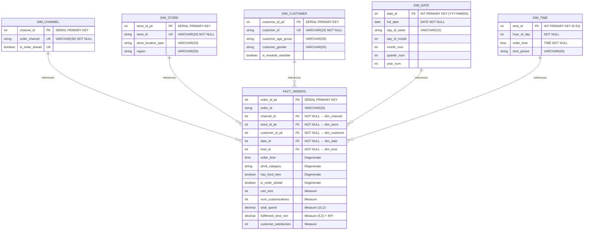

# Star Schema: Starbucks Data Warehouse

## Visual Diagram (Entity-Relationship)



---

## Schema Architecture Summary

### 📦 Dimensiones (5 Tablas)

| Dimensión | Clave Subrogada | Business Key | Atributos | Propósito |
|-----------|-----------------|--------------|-----------|-----------|
| **dim_channel** | `channel_id` (SERIAL) | `order_channel` + `is_order_ahead` | 2 atributos | Segmentar por canal (Drive-Thru, Mobile, Kiosk, In-Store) |
| **dim_store** | `store_id_pk` (SERIAL) | `store_id` | `store_location_type` (Urban/Suburban/Rural), `region` (Northeast/Midwest/Southwest/West) | Análisis geográfico y tipos de tienda |
| **dim_customer** | `customer_id_pk` (SERIAL) | `customer_id` | `customer_age_group`, `customer_gender`, `is_rewards_member` | Segmentación demográfica y análisis de lealtad |
| **dim_date** | `date_id` (INT YYYYMMDD) | `full_date` | `day_of_week`, `day_of_month`, `month_num`, `quarter_num`, `year_num` | Análisis temporal con aritmética rápida |
| **dim_time** | `time_id` (INT 0-23) | `hour_of_day` | `order_time`, `time_period` (Morning Rush / Mid-Day / Afternoon / Evening / Other) | Análisis horario y períodos de negocio |

### 📊 Tabla de Hechos (1 Tabla)

| Aspecto | Detalles |
|--------|----------|
| **Tabla** | `fact_orders` |
| **Rows** | ~100,000 órdenes |
| **Clave Primaria** | `order_id_pk` (SERIAL) |
| **Claves Foráneas** | 5 FKs a todas las dimensiones |
| **Dimensión Degenerada** | `order_id`, `drink_category`, `has_food_item`, `is_order_ahead` |
| **Medidas (Measures)** | `cart_size`, `num_customizations`, `total_spend`, `fulfillment_time_min` ⭐, `customer_satisfaction` |

---

## Cardinalidades y Relaciones FK

```
Cardinality Notation (||--o{):
  ||  = One (1)
  o{  = Many (0..N)
```

### Relaciones Establecidas

1. **dim_channel (1) ← fact_orders (N)**
   - FK: `fact_orders.channel_id` → `dim_channel.channel_id`
   - Cardinalidad: 1 canal : muchas órdenes
   - Ejemplo: 4 canales × 25,000 órdenes c/uno = 100k órdenes

2. **dim_store (1) ← fact_orders (N)**
   - FK: `fact_orders.store_id_pk` → `dim_store.store_id_pk`
   - Cardinalidad: 1 tienda : muchas órdenes
   - Ejemplo: ~100 tiendas × 1,000 órdenes c/una = 100k órdenes

3. **dim_customer (1) ← fact_orders (N)**
   - FK: `fact_orders.customer_id_pk` → `dim_customer.customer_id_pk`
   - Cardinalidad: 1 cliente : muchas órdenes
   - Ejemplo: ~40k clientes × 2.5 órdenes promedio = 100k órdenes

4. **dim_date (1) ← fact_orders (N)**
   - FK: `fact_orders.date_id` → `dim_date.date_id`
   - Cardinalidad: 1 fecha : muchas órdenes
   - Ejemplo: ~30 días × 3,333 órdenes/día = 100k órdenes

5. **dim_time (1) ← fact_orders (N)**
   - FK: `fact_orders.time_id` → `dim_time.time_id`
   - Cardinalidad: 1 hora : muchas órdenes
   - Ejemplo: 24 horas × 4,166 órdenes/hora = 100k órdenes

---

## Diseño de Claves

### Claves Subrogadas (Surrogate Keys)
Las dimensiones usan **SERIAL** para las claves primarias:
- `dim_channel.channel_id` (auto-incremented)
- `dim_store.store_id_pk` (auto-incremented)
- `dim_customer.customer_id_pk` (auto-incremented)

**Ventajas:**
- ✅ Protegen contra cambios en claves naturales
- ✅ Simplifican JOINs con espacios clave pequeños (INT vs VARCHAR)
- ✅ Soportan historización (SCD Type 2)

### Claves de Negocio (Business Keys)
Son auto-descriptivas y únicas:
- `dim_channel`: (`order_channel`, `is_order_ahead`)
- `dim_store`: `store_id`
- `dim_customer`: `customer_id`
- `dim_date`: `full_date` (alternativa: `date_id` int YYYYMMDD)
- `dim_time`: `hour_of_day` (0-23)

**Ventajas:**
- ✅ Permiten auditoría de datos de fuente
- ✅ Facilitan JOINs ETL durante carga
- ✅ Soportan reconciliación origen ↔ destino

---

## Medidas Analíticas (Fact Table)

La tabla `fact_orders` contiene **4 medidas principales** y **1 degenerate dimension**:

### Medidas Aditivas (Aggregables)
| Medida | Tipo | Rango | Uso |
|--------|------|-------|-----|
| `cart_size` | INT | 1-5 items | Análisis de canasta |
| `num_customizations` | INT | 0-10+ | Complejidad orden |
| `total_spend` | DECIMAL(10,2) | $2-$25 | Revenue, ticket promedio |
| `fulfillment_time_min` | DECIMAL(5,2) | 2-10 min | ⭐ **KPI CRÍTICO** |
| `customer_satisfaction` | INT | 1-5 stars | NPS, satisfacción |

### Dimensión Degenerada
Atributos que residen en fact pero no tienen tabla dim separada:
- `order_id`: ID transaccional de la orden
- `drink_category`: Tipo de bebida (Coffee, Tea, Smoothie, etc.)
- `has_food_item`: Si la orden incluye comida
- `is_order_ahead`: Si fue preorden (Mobile App)

**Justificación:** Cardinalidad muy alta o atributos analizados raramente → eficiencia.

---

## Índices de Rendimiento

```sql
CREATE INDEX idx_fo_channel   ON fact_orders(channel_id);
CREATE INDEX idx_fo_store     ON fact_orders(store_id_pk);
CREATE INDEX idx_fo_date      ON fact_orders(date_id);
CREATE INDEX idx_fo_time      ON fact_orders(time_id);
CREATE INDEX idx_fo_customer  ON fact_orders(customer_id_pk);
```

**Beneficio:** Acelera JOINs y filtros en consultas analíticas.

---

## Validación del Diagrama

✅ **Mermaid Syntax Check:**
- [x] 5 dimensiones presentes (dim_channel, dim_store, dim_customer, dim_date, dim_time)
- [x] 1 tabla hecho con 5 FKs
- [x] Cardinalidad explícita (||--o{)
- [x] Atributos clave con notación $
- [x] Tipos de datos indicados

✅ **Completitud:**
- [x] Todas las columnas de [02_CREATE_STAR_SCHEMA.sql](../Database/02_CREATE_STAR_SCHEMA.sql) incluidas
- [x] Relaciones FK representadas
- [x] Claves primarias y únicas marcadas
- [x] Degenerate dimensions documentadas

---

**Diagrama generado:** 23 de Marzo, 2026  
**Schema Version:** PostgreSQL (starbucks_dw_raw.star)  
**Status:** ✅ Listo para validación en https://mermaid.live
