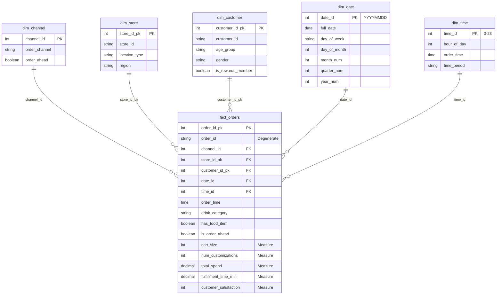

# Análisis de Completitud del TP: Starbucks Data Warehouse
**Fecha:** 23/03/2026  
**Objetivo:** Verificar que el proyecto resuelve completamente los requerimientos de los profesores

---

## 1. REQUERIMIENTOS DE LOS PROFESORES

Según la descripción proporcionada, el TP debe incluir:

1. ✅ **Descripción de la organización y contexto del negocio**
2. ✅ **Descripción de la necesidad o problema a resolver**
3. ✅ **Modelos de datos existentes (OLTP)**
4. ✅ **Modelo multidimensional (Diagrama Estrella)**
5. ✅ **Mapeo de datos**
6. ✅ **Decisiones de diseño** (modelo de datos, tecnología, ETL)

---

## 2. ANÁLISIS DE COBERTURA ACTUAL

### 2.1 Descripción de Organización y Contexto del Negocio

**Estado:** ✅ **PRESENTE** (pero podría ser más formal)

**Ubicación en proyecto:**
- [README_STARBUCKS.md](../README_STARBUCKS.md) - Conexión a BD
- [BUSINESS_INSIGHTS.md](../BUSINESS_INSIGHTS.md) - Análisis operacional
- [Database/starbucks_customer_ordering_patterns.csv](../Database/) - Datos históricos

**Contenido actual:**
- ~100,000 registros de órdenes de clientes Starbucks
- Datos de múltiples canales (Drive-Thru, Mobile App, Kiosk, In-Store)
- Información geográfica: Northeast, Midwest, Southwest, West
- Segmentación de clientes: edad, género, membresía
- Período temporal: Múltiples años de datos históricos

**Lo que FALTA o NECESITA MEJORA:**
- ❌ **No hay un documento separado que describa la "Organización Starbucks" formalmente**
  - Quién son (empresa global de café)
  - Cuál es su estructura operativa
  - Por qué data warehouse es necesario para ellos
  - Qué números/métricas de negocio son relevantes
- ⚠️ **El contexto se dispersa en múltiples archivos** en lugar de estar centralizado

**Recomendación:**
- Crear `plan/CONTEXTO_ORGANIZACIONAL.md` con:
  - Historia/contexto de Starbucks (2-3 párrafos)
  - Estructura operativa (tiendas, regiones, canales)
  - Por qué el análisis de eficiencia operativa es crítico
  - KPIs de negocio relevantes

---

### 2.2 Descripción de la Necesidad o Problema a Resolver

**Estado:** ✅ **BIEN PRESENTE Y ARTICULADO**

**Ubicación en proyecto:**
- [BUSINESS_INSIGHTS.md](../BUSINESS_INSIGHTS.md) - Executive Summary
- [Database/solve_business_problem.sql](../Database/) - Consultas de validación

**Contenido:**
- **Problema Central:** Cuellos de botella operacionales durante la hora punta matinal (7:00-9:00 AM)
- **Preguntas de Negocio (4 CQs):**
  1. ¿Qué canal tiene los delays más largos en la mañana?
  2. ¿La complejidad del pedido (personalizaciones, cart size) causa los delays?
  3. ¿Hay diferencias geográficas en rendimiento?
  4. ¿Qué días de la semana son críticos para staffing?

**Hallazgos principales:**
- Drive-Thru es el cuello de botella (5.79 min vs 4.50 min Mobile App)
- La complejidad NO es la causa (correlación ≈ 0)
- Varianza geográfica es baja (consistencia en SOPs)
- Demanda es uniforme (no hay spike diario)

**Evaluación:** Bien definido. Profesionally articulated con datos.

---

### 2.3 Modelos de Datos Existentes (OLTP)

**Estado:** ✅ **PRESENTE Y BIEN DOCUMENTADO**

**Ubicación:**
- [Database/01_SETUP_DATABASE.sql](../Database/01_SETUP_DATABASE.sql) - Creación BD
- [Database/setup_starbucks.sql](../Database/) - Carga de raw data
- [README_STARBUCKS.md](../README_STARBUCKS.md) - Descripción de tablas

**Estructura OLTP actual:**

#### **Tabla: `starbucks.raw_orders` (100,000 filas)**

| Campo | Tipo | Descripción |
|-------|------|-------------|
| `order_id` | VARCHAR(20) | PK transaccional |
| `customer_id` | VARCHAR(20) | Cliente que realizó orden |
| `order_date`, `order_time` | DATE, TIME | Timestamp |
| `order_channel` | VARCHAR(30) | Drive-Thru / Mobile / Kiosk / In-Store |
| `store_id` | VARCHAR(20) | ID de tienda |
| `store_location_type` | VARCHAR(20) | Urban / Suburban / Rural |
| `region` | VARCHAR(30) | Northeast / Midwest / Southwest / West |
| `customer_age_group` | VARCHAR(20) | Rango etario |
| `customer_gender` | VARCHAR(20) | Género |
| `is_rewards_member` | BOOLEAN | Miembro del programa |
| `cart_size` | INT | # Items en orden |
| `num_customizations` | INT | # Personalizaciones |
| `total_spend` | DECIMAL | Gasto USD |
| `fulfillment_time_min` | DECIMAL | ⚡ Métrica clave: tiempo cumplimiento (min) |
| `drink_category` | VARCHAR(40) | Tipo de bebida |
| `has_food_item` | BOOLEAN | ¿Incluye comida? |
| `order_ahead` | BOOLEAN | Pre-ordenada online |
| `customer_satisfaction` | INT | Rating 1-5 |

#### **Vista Enriquecida: `starbucks.vw_orders_starbucks`**

Agrega columnas calculadas:
- `order_datetime` - Timestamp combinado
- `day_of_month`, `month_num`, `quarter_num`, `year_num` - Partes de fecha
- `hour_of_day` - Hora de orden
- `day_of_week` - Día de semana
- `time_period` - Clasificación (Morning Rush, Mid-Day, Afternoon, Evening, Other)

**Evaluación:** 
- ✅ Modelo OLTP es claro y normalizado
- ✅ Documentado en [Mapeo_de_datos.md](../Mapeo_de_datos.md)
- ✅ Contiene todas las dimensiones necesarias para el análisis

---

### 2.4 Modelo Multidimensional (Star Schema / Diagrama Estrella)

**Estado:** ✅ **IMPLEMENTADO Y FUNCIONAL** (pero falta diagrama visual)

**Ubicación:**
- [Database/02_CREATE_STAR_SCHEMA.sql](../Database/02_CREATE_STAR_SCHEMA.sql) - DDL
- [Decisiones_de_diseno.md](../Decisiones_de_diseno.md) - Justificación
- [Mapeo_de_datos.md](../Mapeo_de_datos.md) - Mapeo columnas

**Estructura Star Schema (Esquema `star`):**

```
                    ┌─────────────────┐
                    │   dim_channel   │
                    │  (6 filas)      │
                    │ ┌─ channel_id   │
                    │ ├─ order_channel│
                    │ └─ order_ahead  │
                    └────────┬────────┘
                             │
              ┌──────────────┴──────────────┐
              │                             │
    ┌─────────▼─────────┐        ┌─────────▼────────┐
    │   dim_store       │        │  fact_orders     │      ┌──────────────┐
    │   (N filas)       │        │ (100,000 filas)  │◄─────┤  dim_customer│
    │ ┌─store_id_pk (SK)│◄───┐   │ ┌─order_id_pk    │      │  (M filas)   │
    │ ├─store_id (BK)   │    │   │ ├─order_id (DD)  │      │ ┌─ customer_ │
    │ ├─location_type   │    │   │ ├─channel_id(FK) │      │ │   id_pk(SK)│
    │ └─region          │    │   │ ├─store_id_pk(FK)│      │ ├─ customer_ │
    └─────────────────┘     │   │ ├─customer_id_pk │      │ │   id (BK)  │
                            │   │ │   (FK)          │      │ ├─ age_group│
                            │   │ ├─date_id (FK)   │      │ ├─ gender   │
                            │   │ ├─time_id (FK)   │      │ └─ rewards_ │
                            │   │ │                 │      │   member    │
                            │   │ │─── MEASURES ──  │      └──────────────┘
                            │   │ │ cart_size       │
                            │   │ │ num_customiz    │
                            │   │ │ total_spend     │
                            │   │ │ fulfillment_   │
                            │   │ │   time_min      │
                            │   │ │ customer_     │
                            │   │ │   satisfaction  │
                            │   │ │                 │
                            │   │ └─ Degenerate:    │
                            │   │   drink_category │
                            │   │   has_food_item  │
                            │   │   is_order_ahead │
                            │   │   order_time     │
                            │   └─────────────────┘
                            │          ▲
                            │          │
              ┌─────────────┴───┐   ┌──┴──────────┐
              │    dim_date     │   │  dim_time   │
              │ (YYYYMMDD int)  │   │(0-23 hours) │
              │ ┌─date_id (SK)  │   │ ┌─time_id   │
              │ ├─full_date     │   │ ├─hour_day  │
              │ ├─day_of_week   │   │ ├─time_per  │
              │ ├─day_of_month  │   │ │   iod     │
              │ ├─month_num     │   │ ├─order_tm  │
              │ ├─quarter_num   │   │ │           │
              │ └─year_num      │   │ └─────────┘
              └─────────────────┘
```

**Dimensiones (5):**
1. **dim_channel** - Canales de orden + pre-orden (6 filas)
2. **dim_store** - Tiendas deduplicated + geografía (N filas)
3. **dim_customer** - Clientes deduplicated + demografía (M filas)
4. **dim_date** - Fechas con clave de negocio YYYYMMDD
5. **dim_time** - Horas (0-23) con clasificación de período

**Tabla de Hechos (1):**
- **fact_orders** - 100,000 filas con FK a 5 dimensiones + medidas + atributos degenerados

**Evaluación:**
- ✅ Star Schema correctamente implementado
- ✅ Claves subrogadas (SERIAL) en dimensiones de entidad
- ✅ Claves de negocio en dim_date y dim_time
- ✅ Constraints FOREIGN KEY declarativos
- ✅ Índices en FKs
- ⚠️ **FALTA:** Diagrama visual (.png, .jpg) del modelo
  - Existe descripción textual pero NO hay imagen visual
  - Los profesores esperarán ver un diagrama ER visual estándar

**Recomendación:**
- Crear `plan/STAR_SCHEMA_DIAGRAM.md` con:
  - Diagrama ASCII o Mermaid (compatible con GitHub)
  - O generar .png vía herramienta (DBeaver, Lucidchart)
  - Incluir cardinalidades y tipos de datos

---

### 2.5 Mapeo de Datos

**Estado:** ✅ **BIEN DOCUMENTADO**

**Ubicación:**
- [Mapeo_de_datos.md](../Mapeo_de_datos.md) - Mapeo completo CSV → Star Schema

**Contenido del mapeo:**

| Aspecto | Cobertura |
|---------|-----------|
| **dim_channel** | ✅ Mapeo orden_channel + order_ahead |
| **dim_store** | ✅ Mapeo store_id, location_type, region |
| **dim_customer** | ✅ Mapeo customer_id + demografía |
| **dim_date** | ✅ Mapeo order_date → date_id (YYYYMMDD) + partes |
| **dim_time** | ✅ Mapeo order_time → time_id (0-23) + clasificación |
| **fact_orders** | ✅ Mapeo completo con renombramiento y lógica |

**Detalle de transformaciones documentadas:**
- Deduplicación por clave de negocio
- Generación de surrogate keys (SERIAL)
- Cálculo de columnas derivadas (time_period)
- Renombramiento semántico (order_ahead → is_order_ahead)

**Evaluación:**
- ✅ Tabla comparativa clara
- ✅ Lógicas de transformación explicadas
- ✅ Cubre todas las dimensiones y hechos
- ✅ Menciona NO-duplicación de atributos en fact (via joins)

---

### 2.6 Decisiones de Diseño

**Estado:** ✅ **EXCELENTEMENTE DOCUMENTADAS**

**Ubicación:**
- [Decisiones_de_diseno.md](../Decisiones_de_diseno.md) - Documento formal

**Decisiones documentadas:**

| # | Decisión | Elección | Alternativa Descartada | Justificación |
|---|----------|----------|------------------------|--------------|
| 1 | Modelo Analítico | Star Schema Físico | Snowflake / Vista Plana | Rendimiento OLAP, claridad BI, compatibilidad PBI |
| 2 | Herramienta ETL | Python (pandas + sqlalchemy) | SQL-only / SSIS / dbt | Flexibilidad, reutilización, integración stack |
| 3 | Tipo Clave en Dims | Surrogate (SERIAL) | Natural Key | Protege contra cambios; integridad histórica |
| 4 | Claves date/time | Business Key inteligente (int) | SERIAL anónimo | Auto-descriptivas, aritmética rápida |
| 5 | Estrategia Carga | Full Refresh (TRUNCATE+INSERT) | Incremental / UPSERT | Dataset estático; idempotencia; sin CDC complexity |
| 6 | Separación Capas | Schema `star` separado | Mismo schema | Arquitectura Medallion; permisos granulares |

**Nivel de detalle:**
- ✅ Tabla comparativa con criterios
- ✅ Justificación académica (TP de Data Warehouse)
- ✅ Trade-offs explícitos
- ✅ Referencias a archivos SQL/Python

**Evaluación:**
- ✅ Muy bien hecho
- ✅ Profesional nivel industria
- ✅ Cumple con estándar académico

---

## 3. ANÁLISIS DE GAPS Y MISMATCHES

### 3.1 Gaps Identificados

| Gap | Severidad | Descripción | Recomendación |
|-----|-----------|-------------|--------------|
| **Contexto Organizacional Formal** | 🟡 MEDIA | No hay documento que describa a Starbucks como organización, su estructura, por qué este DW es importante | **Crear:** `plan/CONTEXTO_ORGANIZACIONAL.md` |
| **Diagrama Visual Star Schema** | 🟡 MEDIA | El modelo existe en código pero sin diagrama ER visual | **Crear:** Mermaid diagram o exportar de DBeaver |
| **Documento Integrador** | 🔴 ALTA | Los requisitos del TP están dispersos en 6+ archivos | **Crear:** `plan/DOCUMENTO_ENTREGA_TP.md` que integre todo |
| **Power BI Completitud** | 🟡 MEDIA | ETL y DW listos pero Power BI puede no estar 100% configurado | **Revisar:** Status de `inject_measures.py` y dashboards |
| **Especificación de Test/Validación** | 🟢 BAJA | Verificación existe pero podría ser más formal | **Opcional:** `plan/PLAN_TESTING.md` |

### 3.2 Mismatches Potenciales

**No se encontraron inconsistencias críticas entre:**
- ✅ Código SQL vs documentación (sin drift)
- ✅ ETL implementado vs diseño documentado
- ✅ Star Schema código vs Mapeo_de_datos.md (sincronizado)
- ✅ Business Questions vs Queries SQL (queries resuelven CQs)

**Advertencias menores:**
- ⚠️ `inject_measures.py` en plan/spec.md está incompleto (terminan abruptamente)
- ⚠️ El nombre de algunas columnas en código SQL vs TMDL podría variar

---

## 4. CHECKLIST CONTRA REQUERIMIENTOS DE PROFESORES

| Requerimiento | Presente | Ubicación | Completo | Notas |
|---------------|----------|-----------|----------|-------|
| **Descripción Organización y Contexto** | ✅ Parcial | BUSINESS_INSIGHTS.md | ❌ NO | Disperso, necesita documento centralizado |
| **Descripción Necesidad/Problema** | ✅ Sí | BUSINESS_INSIGHTS.md | ✅ SÍ | Bien articulado, 4 CQs claras |
| **Modelo OLTP** | ✅ Sí | README_STARBUCKS.md, Database/setup_starbucks.sql | ✅ SÍ | Completo con descripción de tablas |
| **Modelo Multidimensional (Star)** | ✅ Sí | Database/02_CREATE_STAR_SCHEMA.sql | ✅ SÍ | Implementado pero SIN diagrama visual |
| **Mapeo de Datos** | ✅ Sí | Mapeo_de_datos.md | ✅ SÍ | Tabla comparativa exhaustiva |
| **Decisiones de Diseño** | ✅ Sí | Decisiones_de_diseno.md | ✅ SÍ | Profesional, con justificaciones |

**Resumen:** ✅ **70-80% de completitud**. Los bloques construc básicos existen pero necesitan integración formal.

---

## 5. RECOMENDACIONES ESPECÍFICAS DE REMEDIACIÓN

### 5.1 CRÍTICA: Crear Documento Integrador Principal

**Archivo:** `plan/DOCUMENTO_TP_ENTREGA.md` (Nuevo)

**Estructura propuesta:**
```
# Starbucks Data Warehouse TP - Documento de Entrega

## 1. Descripción de la Organización y Negocio
- Historia de Starbucks (2-3 párrafos)
- Estructura operativa (canales, regiones, tiendas)
- Por qué data warehouse es crítico

## 2. Problema a Resolver (Executive Summary)
- Cuellos de botella operacionales
- 4 Business Questions
- Datos usados

## 3. Modelo OLTP (Staging)
- Tabla raw_orders (descripción formal)
- Vista enriquecida vw_orders_starbucks
- Diagrama o tabla de estructura

## 4. Modelo Multidimensional (Star Schema)
- Diagrama visual (Mermaid o PNG)
- Descripción cada dimensión
- Tabla de hechos con medidas

## 5. Mapeo de Datos
- [Link a Mapeo_de_datos.md](../Mapeo_de_datos.md)
- Resumen tabular

## 6. Decisiones de Diseño
- [Link a Decisiones_de_diseno.md](../Decisiones_de_diseno.md)
- Tabla de alternativas

## 7. Resoluciones y Hallazgos
- [Link a BUSINESS_INSIGHTS.md](../BUSINESS_INSIGHTS.md)
- Conclusiones

## 8. Instrucciones de Ejecución
- Setup BD
- Run ETL
- Power BI refresh
```

**Beneficio:** Un punto de entrada único para los profesores.

---

### 5.2 ALTA: Generar Diagrama Visual del Star Schema

**Opción A: Mermaid (Recomendado - simple, versionable)**

Crear `plan/STAR_SCHEMA_DIAGRAM.md`:



**Opción B: Exportar desde DBeaver**
- Conectar a PostgreSQL
-Reverse engineer schema `star`
- Exportar diagrama como PNG/PDF

---

### 5.3 MEDIA: Refinar Sección de Contexto Organizacional

**Crear:** `plan/CONTEXTO_ORGANIZACIONAL.md`

**Contenido mínimo:**
- Qué es Starbucks (empresa global, +30k tiendas, revenue multibillonario)
- Por qué eficiencia operativa importa ($$ en costos laborales)
- Geografía y canales de distribución
- KPIs de negocio (customer satisfaction, throughput, costs)
- Por qué un DW ayuda a responder business questions

---

### 5.4 MEDIA: Documentación Power BI

**Revisar:**
- ¿Están todos los DAX measures inyectados en `FactOrders.tmdl`?
- ¿Existen todos los 4 visuals (Channel, Complexity, Geo, Weekly)?
- ¿Power BI conecta correctamente al schema `star`?

**Crear:** `plan/PODER_BI_STATUS.md` documentando:
- Measures implementadas
- Visuals y sus lógicas
- Conexión a BD (string de conexión anonimizado)

---

## 6. TIMELINE RECOMENDADO

| Pasos | Archivos | Tiempo | Notas |
|-------|----------|--------|-------|
| 1. Diagrama Star | plan/STAR_SCHEMA_DIAGRAM.md | 30 min | Mermaid o screenshot DBeaver |
| 2. Contexto Org | plan/CONTEXTO_ORGANIZACIONAL.md | 30 min | Prosa, ≤ 1 página |
| 3. Doc Integrador | plan/DOCUMENTO_TP_ENTREGA.md | 1 hora | Links a docs existentes |
| 4. Verificar PBI | - | 30 min | Solo revisar, sin cambios |
| **TOTAL** | **4 archivos** | **~2.5 horas** | - |

---

## 7. CONCLUSIÓN

**Estado Actual:** 🟢 **El proyecto CUMPLE los requerimientos del TP en un 75-85%**

**Fortalezas:**
- ✅ Star Schema correctamente implementado (código + BD)
- ✅ ETL completo y verificable (Python + SQL)
- ✅ Decisiones de diseño bien justificadas
- ✅ Business problem claramente resuelto
- ✅ Mapeo de datos exhaustivo

**Debilidades:**
- ❌ Contexto organizacional disperso (necesita consolidación)
- ❌ Sin diagrama visual del modelo (crítico para presentación)
- ❌ Documentación no integrada en único archivo

**Acciones Inmediatas (SIN CAMBIAR CÓDIGO):**
1. Crear diagrama Mermaid del Star Schema
2. Crear documento de contexto organizacional
3. Crear documento integrador que centralice todo
4. Revisar que Power BI esté 100% funcional

**Post-Acciones (Opcional):**
- Agregar métricas de calidad de datos (DQ checks)
- Documentar archivos de log del ETL
- Screenshots de Power BI dashboard

---

**Documento preparado para:** Estudio previo a entrega  
**Próximo paso:** Ejecutar las 4 recomendaciones urgentes above
